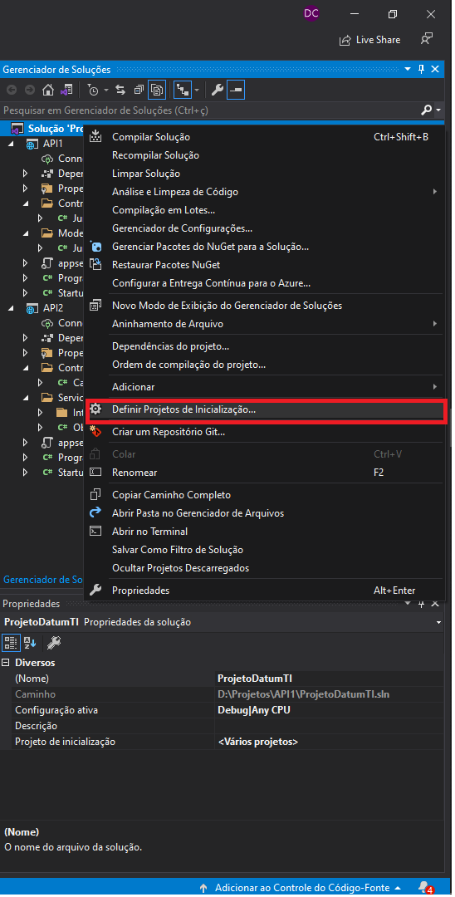
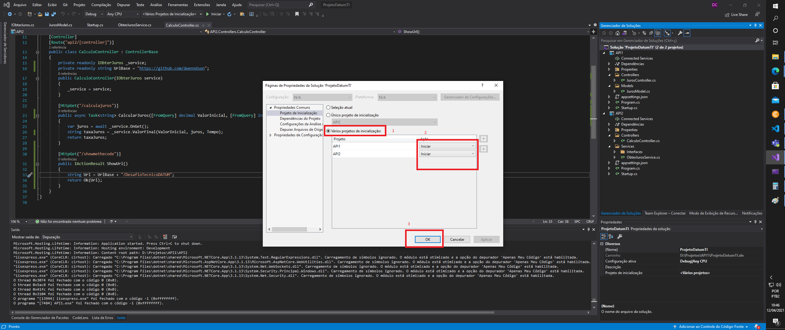

# DesafioTecnicoDATUM

## Inicialização projeto

  #### A API2 depende de informações da API1 então necessário inicializar as duas API em conjuto

## Configuração

#### Com a solution aberta click botão direito na solution vá até "Definir projetos de Inicialização..."

#### Em Projetos de Inicialização 
#### click variaos projetos de inicialização "1"
#### Iniciar em cada projeto "2"
#### Ok "3"

